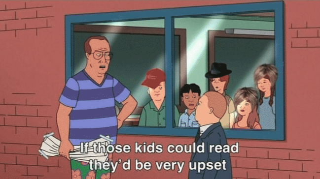

# Which writing styles should I follow?
{: .fs-9 }

---

There are so many ways to write Markdown. This is a personal preference list of
writing styles that adhere to CommonMark and Associated Press Stylebook.
